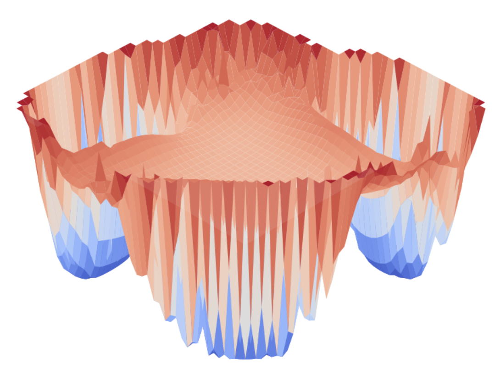
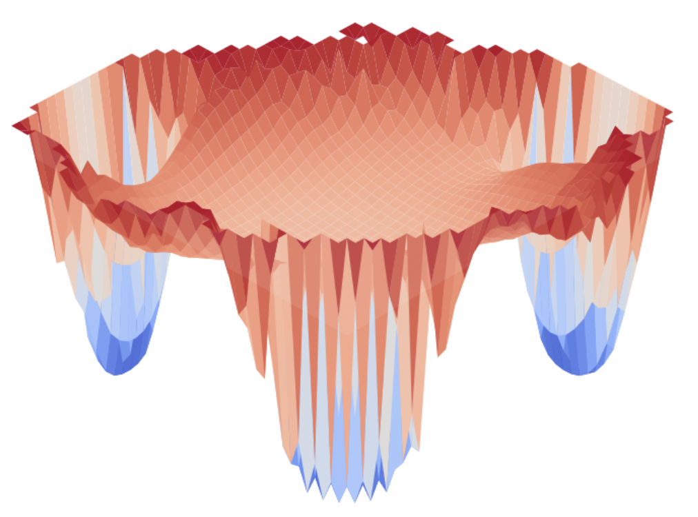
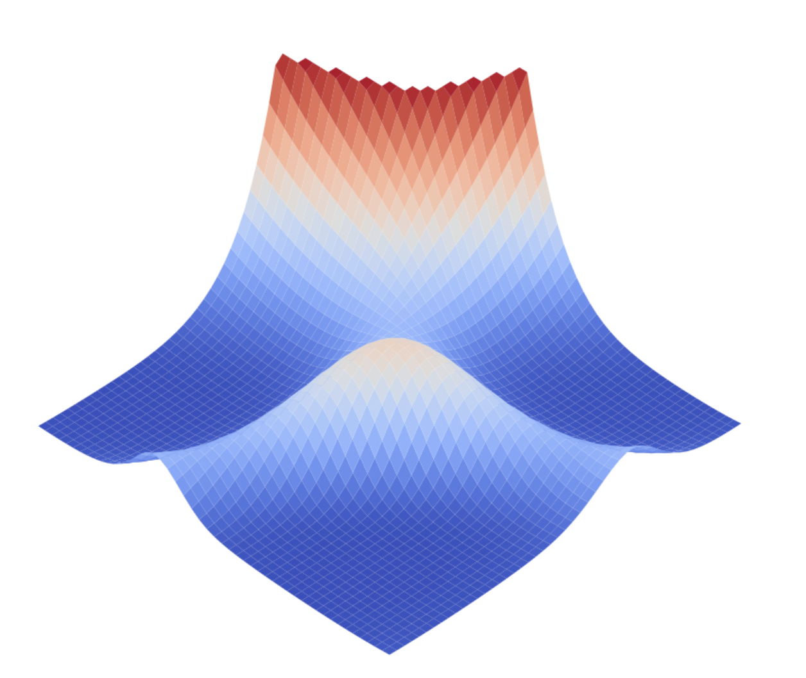
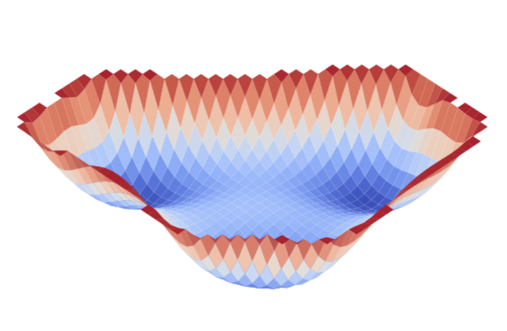

# Robust Deep Learning
Repository for reproducing the experiments from section IV in Theory of Deep Learning IIb: Optimization Properties of SGD 
(https://arxiv.org/pdf/1801.02254.pdf).

The VGG16 three-point interpolations of loss surface on CIFAR-10 in case of natural and random labels look as follows:
  
&nbsp; &nbsp; &nbsp; &nbsp; &nbsp; &nbsp; &nbsp; &nbsp; &nbsp; &nbsp; **Figure 1:** CIFAR-10 natural labels &nbsp; &nbsp; &nbsp; &nbsp; &nbsp; &nbsp; &nbsp; &nbsp; &nbsp; &nbsp; &nbsp; &nbsp; &nbsp; &nbsp; &nbsp; &nbsp; &nbsp; &nbsp; &nbsp; &nbsp; &nbsp; &nbsp; &nbsp;     **Figure 2:** CIFAR-10 random labels

The MPL three-point interpolations of loss surface on MNIST in case of natural and random labels look as follows:
  
&nbsp; &nbsp; &nbsp; &nbsp; &nbsp; &nbsp; &nbsp; &nbsp; &nbsp; &nbsp; &nbsp;  &nbsp;  **Figure 3:** MNIST natural labels &nbsp; &nbsp; &nbsp; &nbsp; &nbsp; &nbsp; &nbsp; &nbsp; &nbsp; &nbsp; &nbsp; &nbsp; &nbsp; &nbsp; &nbsp; &nbsp; &nbsp; &nbsp; &nbsp; &nbsp; &nbsp; &nbsp; &nbsp; &nbsp; &nbsp; **Figure 4:** MNIST random labels

It can be seen that minima is more flat for both datasets in case of natural labelling, as claimed. The “flatness test” results are displayed on **Table 1** below.

|  | MNIST | CIFAR-10 |
| --- | --- | --- |
| all params | 13.9833 ± 0.1670 | 14.2999 ± 0.2943 |
| all params (random label) | 4.6333 ± 0.2461 | 7.3167 ± 0.1312 |
| top layer | 2.3400 ± 0.1393 | 10.2667 ± 0.5632 |
| top layer (random label) | 3.8600 ± 0.0497 | 4.8333 ± 0.0471 |

&nbsp; &nbsp; &nbsp; &nbsp; &nbsp; &nbsp; &nbsp; &nbsp; &nbsp; &nbsp; &nbsp;  &nbsp; &nbsp; &nbsp; &nbsp; &nbsp; &nbsp; &nbsp; &nbsp; &nbsp; &nbsp; &nbsp; &nbsp;  **Table 1:** Flatness test

The **Table 1** provides with evidence (except top layer on MNIST which is sensitive) that in the case of random labelling the minimums of loss function are more sharp in comparison to the natural labelling.


### Run experiments
First of all, train NNs with 3 different initializations with natural and random labelling:
``` bash
$ python make_random_labels.py
$ CUDA_VISIBLE_DEVICES=id python train_{mnist/cifar}.py 
$ CUDA_VISIBLE_DEVICES=id python train_{mnist/cifar}_random.py 
```
After that, prepare data for three-points interpolations:
``` bash
$ CUDA_VISIBLE_DEVICES=id python make_points_{mnist/cifar}.py 
$ CUDA_VISIBLE_DEVICES=id python train_{mnist/cifar}_random.py 
```
And finally run cells in ```testing.ipynb``` to check surfaces. Two reproduce "flatness test" results run:
``` bash
$ CUDA_VISIBLE_DEVICES=id python measure_radius_{mnist/cifar}.py 
$ CUDA_VISIBLE_DEVICES=id python measure_radius_{mnist/cifar}_top.py 
```
with commented and uncommented ```#random``` sections.
